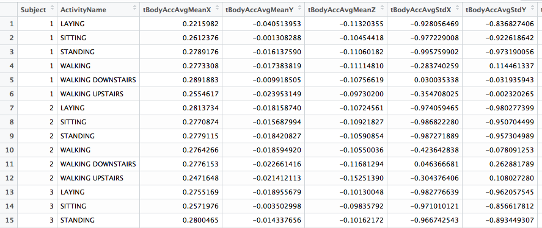

---
#Code Book

#Summary Analysis of Means and Standard Deviations in The UCI Human Activity Recognition Using Smartphones Dataset

##Introduction

In this document we will provide a description of our dataset, any work done to transform the original data, information about the raw data to make our data meaningful, and all of the variables within our dataset.  We use the terms *raw data* and *original data* interchangeably to refer to the data we transformed and tidied.   The R script we used is run_analysis.R.

The raw data for this project came from the *UCI Human Activity Recognition Using Smartphones* Data Set.  Full background information can be found at the [project's web site](http://archive.ics.uci.edu/ml/datasets/Human+Activity+Recognition+Using+Smartphones).  The study authors' datasets and supporting documentation can be downloaded from [UCI HAR Dataset.zip](http://archive.ics.uci.edu/ml/machine-learning-databases/00240/).  Some additional information, particularly on the units used in their data, can be found in [UCI HAR Dataset.names](http://archive.ics.uci.edu/ml/machine-learning-databases/00240/).

##Dataset Description

Our dataset **HumanMovementMeanSummary.txt** provides summary statistics for each of the 6 activities performed by each of the 30 subjects in the original study.  In particular, we provide averages for each of the 66 mean and standard deviation time and frequency variables in the original dataset.  The 66 variables we are referring to contain either mean() or std() within their names in the raw data.  For reference, see features.txt.  

Our comma delimited dataset has 68 variables and 180 observations, with 66 of the variables containing the summary statistics already mentioned plus subject and activity variables for each observation.  There are 6 distinct activity observations for each of the 30 subjects in the study. The 6 activities are LAYING, SITTING, STANDING, WALKING, WALKING DOWNSTAIRS, and WALKING UPSTAIRS.  The data is sorted by subject, and within subject by activity.   The first row of the dataset is a header containing all of the variable names.

[//]: (Insert a view of the tidy data)

A snapshot of the first few subjects and the first five variables:

 

##Transformation of the Original Data

The original study contained 10,299 activity observations for the 30 subjects. The population was randomly divided into two mutually exclusive groups with 70% of the volunteers going into the training group and 30% of the volunteers going into the test group.

For this analysis, we ignored the inertial signals data for the test and training groups and focused on the following files related to activities:

Data File             | Description        
--------------------- | ------------------ 
features.txt          | The 561 time and frequency variables common to X_train.txt and X_test.txt.
X_train.txt           | 7352 lines of observations for the 561 time and frequency variables.
y_train.txt           | 7352 lines with the observation in each line consisting of the *activity* number corresponding to the variable values on the *same* line within X_train.txt.
subject_train.txt     | 7352 lines with the observation in each line consisting of the *subject* number corresponding to the variable values on the *same* line within X_train.txt.
X_test.txt            | 2947 lines of observations for the 561 time and frequency variables.
y_test.txt            | 2947 lines with the observation in each line consisting of the *activity* number corresponding to the variable values on the *same* line within X_test.txt.
subject_test.txt      | 2947 lines with the observation in each line consisting of the *subject* number corresponding to the variable values on the *same* line within X_test.txt.
activity_labels.txt   | The six activities, one per line with a corresponding activity number.

No missing values were found in any of the above data files.   The information in all of these files was combined into one preliminary raw dataset, with an eye on preserving the order of the data until the final dataset was created.   The 561 variables in the raw test and training data were presented in scientific notation.  We used standard decimal notation for our summary values. 

None of the numerical values in the original data were altered while assembling it.   To put the raw data together, we did the following:

1. All of the datasets described above were read in.  Please refer to run_analysis.R for the coding details.  Please refer to README.md for a high-level overview of the script.

2. The column names VariableNumber and VariableName were assigned to the features.

3. The column names ActivityNumber and ActivityName were assigned to the activities and the underscores were removed from the ActivityName column's data.

4. The variable name ActivityNumber was assigned to the single column of data in each of y_test and y_train.

5. The variable name Subject was assigned to the single column of data in each of subject_test and subject_train.

6. We next focused on combining all of the test data by first doing an inner join on the y_test data and the activities data.  The y_test data now contains a description for each activity.  Next, we captured only those variable names from features that contain mean() and std() and then replaced x_test by a subset containing only those 66 columns.  Finally, we did a column bind on subject_test, y_test, and x_test to create test_data with 2947 rows and 69 columns.

7. train_data with 7352 rows and 69 columns was created as we created test_data in #6.

8. Finally, all_data was created by row binding test_data and train_data, with special characters such as ( removed from the original variable names, and mean and std changed to Mean and Std, respectively. ActivityNumber was removed and ActivityName kept. It's dimensions are 10299 x 68.

9. Up to this point, the order of the original data was preserved. 

10. tidy_data was created by first grouping all_data by Subject and ActivityName, and then applying summarize_each to calculate the averages.   The variable names were altered in tidy_data by inserting Avg before each of Mean and Std.  The dimensions are 180 x 68.

11. tidy_data was written out, along with a header containing the variable names, to the comma delimited file HumanMovementMeanSummary.txt.  The file contains 181 lines with
the data for the 180 observations on 68 variables beginning on line 2.
 
##Dataset Variables

####Original variables background:

* The subjects in the study each wore a Samsung Galaxy S II smartphone on their waists while performing the six activities.  Its accelerometer and gyroscope were used to capture three-dimensional (X,Y,Z) linear acceleration and axial angular velocity at a constant rate of 50Hz.  The experiments were recorded on video and then observed to manually record the data points.  The accelerometer and gyroscope signals were filtered into body acceleration and gravity components.   From this filtering, the 561 time and frequency domain variables were obtained for X_train.txt and X_test.txt, and the names of those variables are found in features.txt.

* mean() and std() in the original variables refer to mean and standard deviation values estimated from the three-dimensional time and frequency measurements.  

* All values were normalized to be in the interval [-1,1].  All of the average values we derived in our data preserves this normalization.

* The total number of activities recorded, for each of the 6 activities categories, varies in total number among subjects.   Keep this in mind when considering the averages in our dataset. 

####The units of measurement:

* Body accelerations (BodyAcc) are in g's (Earth's gravitational pull = 1g = 9.80665 m/sec^2^).  An example is tBodyAccAvgMeanX in our dataset.

* The gyroscope (BodyGyro) units are rad/sec (radians per second).  An example is tBodyGyroAvgStdY in our dataset.

* We preserve these units in our dataset.

####About our variable names:

* The X, Y, and Z in our variable names represent each of the three spatial dimensions in the original variables.

* Our variable names were obtained by removing special characters from the raw data's variable names, capitalizing mean and std, and then inserting Avg in front of each them. This allows us to easily refer back to the raw data's variables for context. 

* The variables that begin with *t* refer to time.  An example is tBodyAccAvgMeanX.

* The variables that begin with *f* represent frequencies.  An example is fBodyAccAvgMeanX in our dataset.  The raw data's variables were obtained from a Fast Fourier Transform method applied to selected time variables within the raw data.  

* Variables with Mag in their names reflect magnitudes calculated using the Euclidean norm.  An example is fBodyAccMagAvgMean in our dataset.

####Our dataset's variables:

Number   |  Name                      | Description
-------- | -------------------------- |----------------------------------------
1        | Subject                    | An integer ID for each of the 30 subjects, with values in the range 1 to 30.
2        | ActivityName               | The activity performed by the subject: LAYING, SITTING, STANDING, WALKING, WALKING DOWNSTAIRS, or WALKING UPSTAIRS.
3        | tBodyAccAvgMeanX           | The average of tBodyAcc-mean()-X for each subject's activity.
4        | tBodyAccAvgMeanY	          | The avearge of tBodyAcc-mean()-Y for each subject's activity.
5	 | 	tBodyAccAvgMeanZ 	 | 	The average of tBodyAcc-mean()-Z for each subject's activity.
6	 | 	tBodyAccAvgStdX            	 | 	The average of tBodyAcc-std()-X for each subject's activity.
7	 | 	tBodyAccAvgStdY	 | 	The average of tBodyAcc-std()-Y for each subject's activity.
8	 | 	tBodyAccAvgStdZ 	 | 	The average of tBodyAcc-std()-Z for each subject's activity.
9	 | 	tGravityAccAvgMeanX        	 | 	The average of tGravityAcc-mean()-X for each subject's activity.
10	 | 	tGravityAccAvgMeanY	 | 	The average of tGravityAcc-mean()-Y for each subject's activity.
11	 | 	tGravityAccAvgMeanZ	 | 	The average of tGravityAcc-mean()-Z for each subject's activity.
12	 | 	tGravityAccAvgStdX         	 | 	The average of tGravityAcc-std()-X for each subject's activity.
13	 | 	tGravityAccAvgStdY	 | 	The average of tGravityAcc-std()-Y for each subject's activity.
14	 | 	tGravityAccAvgStdZ	 | 	The average of tGravityAcc-std()-Z for each subject's activity.
15	 | 	tBodyAccJerkAvgMeanX       	 | 	The average of tBodyAccJerk-mean()-X for each subject's activity.
16	 | 	tBodyAccJerkAvgMeanY	 | 	The average of tBodyAccJerk-mean()-Y for each subject's activity.
17	 | 	tBodyAccJerkAvgMeanZ	 | 	The average of tBodyAccJerk-mean()-Z for each subject's activity.
18	 | 	tBodyAccJerkAvgStdX        	 | 	The average of tBodyAccJerk-std()-X for each subject's activity.
19	 | 	tBodyAccJerkAvgStdY	 | 	The average of tBodyAccJerk-std()-Y for each subject's activity.
20	 | 	tBodyAccJerkAvgStdZ	 | 	The average of tBodyAccJerk-std()-Z for each subject's activity.
21	 | 	tBodyGyroAvgMeanX          	 | 	The average of tBodyGyro-mean()-X for each subject's activity.
22	 | 	tBodyGyroAvgMeanY	 | 	The average of tBodyGyro-mean()-Y for each subject's activity.
23	 | 	tBodyGyroAvgMeanZ	 | 	The average of tBodyGyro-mean()-Z for each subject's activity.
24	 | 	tBodyGyroAvgStdX           	 | 	The average of tBodyGyro-std()-X for each subject's activity.
25	 | 	tBodyGyroAvgStdY	 | 	The average of tBodyGyro-std()-Y for each subject's activity.
26	 | 	tBodyGyroAvgStdZ	 | 	The average of tBodyGyro-std()-Z for each subject's activity.
27	 | 	tBodyGyroJerkAvgMeanX 	 | 	The average of tBodyGyroJerk-mean()-X| for each subject's activity.
28	 | 	tBodyGyroJerkAvgMeanY	 | 	The average of tBodyGyroJerk-mean()-Y for each subject's activity.
29	 | 	tBodyGyroJerkAvgMeanZ	 | 	The average of tBodyGyroJerk-mean()-Z for each subject's activity.
30	 | 	tBodyGyroJerkAvgStdX       	 | 	The average of tBodyGyroJerk-std()-X for each subject's activity.
31	 | 	tBodyGyroJerkAvgStdY	 | 	The average of tBodyGyroJerk-std()-Y for each subject's activity.
32	 | 	tBodyGyroJerkAvgStdZ	 | 	The average of tBodyGyroJerk-std()-Z for each subject's activity.
33	 | 	tBodyAccMagAvgMean         	 | 	The average of tBodyAccMag-mean() for each subject's activity.
34	 | 	tBodyAccMagAvgStd	 | 	The average of tBodyAccMag-std() for each subject's activity.
35	 | 	tGravityAccMagAvgMean	 | 	The average of tGravityAccMag-mean() for each subject's activity.
36	 | 	tGravityAccMagAvgStd       	 | 	The average of tGravityAccMag-std() for each subject's activity.
37	 | 	tBodyAccJerkMagAvgMean	 | 	The average of tBodyAccJerkMag-mean()| for each subject's activity.
38	 | 	tBodyAccJerkMagAvgStd	 | 	The average of tBodyAccJerkMag-std() for each subject's activity.
39	 | 	tBodyGyroMagAvgMean        	 | 	The average of tBodyGyroMag-mean() for each subject's activity.
40	 | 	tBodyGyroMagAvgStd	 | 	The average of tBodyGyroMag-std() for each subject's activity.
41	 | 	tBodyGyroJerkMagAvgMean	 | 	The average of tBodyGyroJerkMag-mean() for each subject's activity.
42	 | 	tBodyGyroJerkMagAvgStd     	 | 	The average of tBodyGyroJerkMag-std() for each subject's activity.
43	 | 	fBodyAccAvgMeanX 	 | 	The average of fBodyAcc-mean()-X for each subject's activity.
44	 | 	fBodyAccAvgMeanY	 | 	The average of fBodyAcc-mean()-Y for each subject's activity.
45	 | 	fBodyAccAvgMeanZ           	 | 	The average of fBodyAcc-mean()-Z for each subject's activity.
46	 | 	fBodyAccAvgStdX	 | 	The average of fBodyAcc-std()-X for each subject's activity.
47	 | 	fBodyAccAvgStdY	 | 	The average of fBodyAcc-std()-Y for each subject's activity.
48	 | 	fBodyAccAvgStdZ            	 | 	The average of fBodyAcc-std()-Z for each subject's activity.
49	 | 	fBodyAccJerkAvgMeanX	 | 	The average of fBodyAccJerk-mean()-X for each subject's activity.
50	 | 	fBodyAccJerkAvgMeanY	 | 	The average of fBodyAccJerk-mean()-Y for each subject's activity.
51	 | 	fBodyAccJerkAvgMeanZ       	 | 	The average of fBodyAccJerk-mean()-Z for each subject's activity.
52	 | 	fBodyAccJerkAvgStdX	 | 	The average of fBodyAccJerk-std()-X for each subject's activity.
53	 | 	fBodyAccJerkAvgStdY	 | 	The average of fBodyAccJerk-std()-Y for each subject's activity.
54	 | 	fBodyAccJerkAvgStdZ        	 | 	The average of fBodyAccJerk-std()-Z for each subject's activity.
55	 | 	fBodyGyroAvgMeanX	 | 	The average of fBodyGyro-mean()-X for each subject's activity.
56	 | 	fBodyGyroAvgMeanY	 | 	The average of fBodyGyro-mean()-Y for each subject's activity.
57	 | 	fBodyGyroAvgMeanZ          	 | 	The average of fBodyGyro-mean()-Z for each subject's activity.
58	 | 	fBodyGyroAvgStdX	 | 	The average of fBodyGyro-std()-X for each subject's activity.
59	 | 	fBodyGyroAvgStdY	 | 	The average of fBodyGyro-std()-Y for each subject's activity.
60	 | 	fBodyGyroAvgStdZ           	 | 	The average of fBodyGyro-std()-Z for each subject's activity.
61	 | 	fBodyAccMagAvgMean	 | 	The average of fBodyAccMag-mean() for each subject's activity.
62	 | 	fBodyAccMagAvgStd	 | 	The average of fBodyAccMag-std() for each subject's activity.
63	 | 	fBodyBodyAccJerkMagAvgMean 	 | 	The average of fBodyBodyAccJerkMag-mean() for each subject's activity.
64	 | 	fBodyBodyAccJerkMagAvgStd	 | 	The average of fBodyBodyAccJerkMag-std() for each subject's activity.
65	 | 	fBodyBodyGyroMagAvgMean	 | 	The average of fBodyBodyGyroMag-mean() for each subject's activity.
66	 | 	fBodyBodyGyroMagAvgStd     	 | 	The average of fBodyBodyGyroMag-std() for each subject's activity.
67	 | 	fBodyBodyGyroJerkMagAvgMean	 | 	The average of fBodyBodyGyroJerkMag-mean() for each subject's activity.
68	 | 	fBodyBodyGyroJerkMagAvgStd 	 | 	The average of fBodyBodyGyroJerkMag-std() for each subject's activity.

